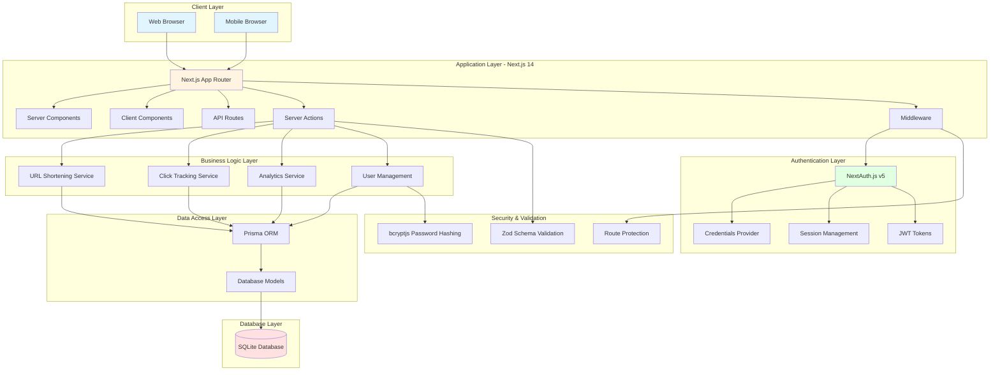
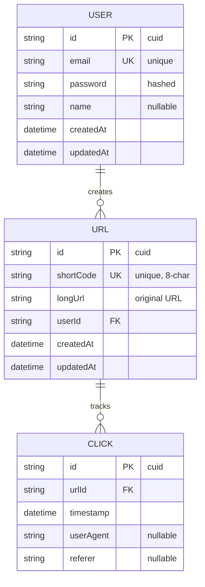
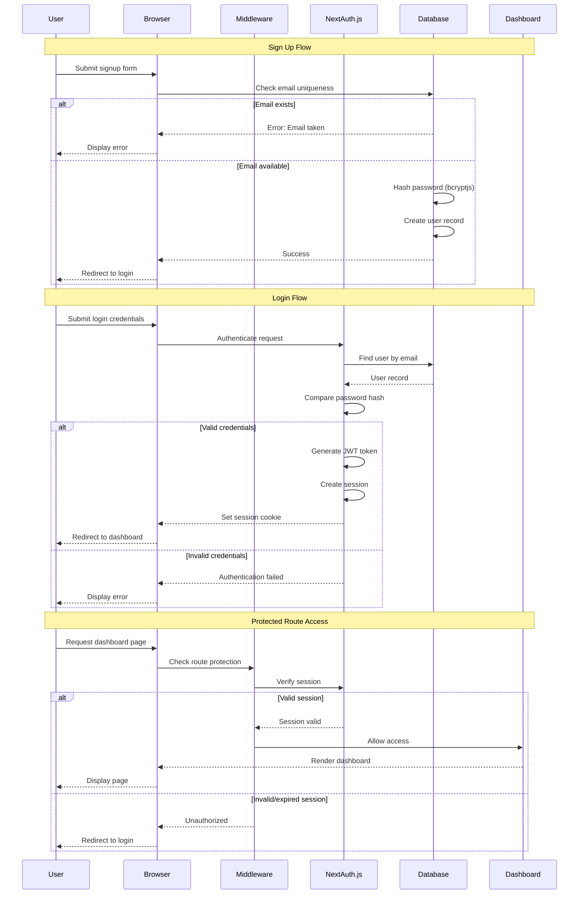
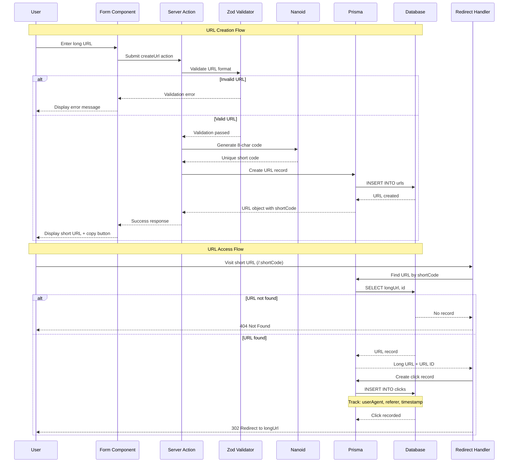
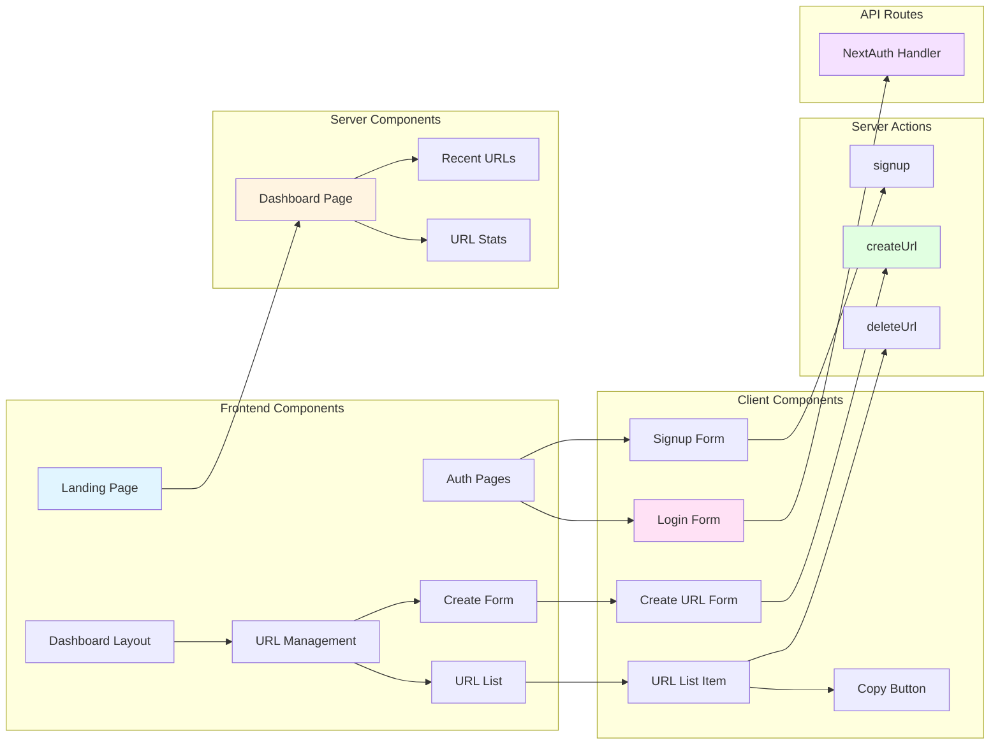
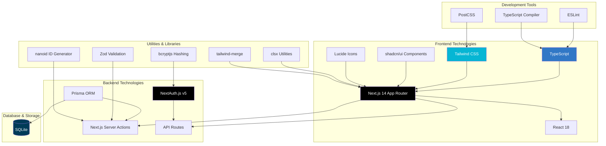
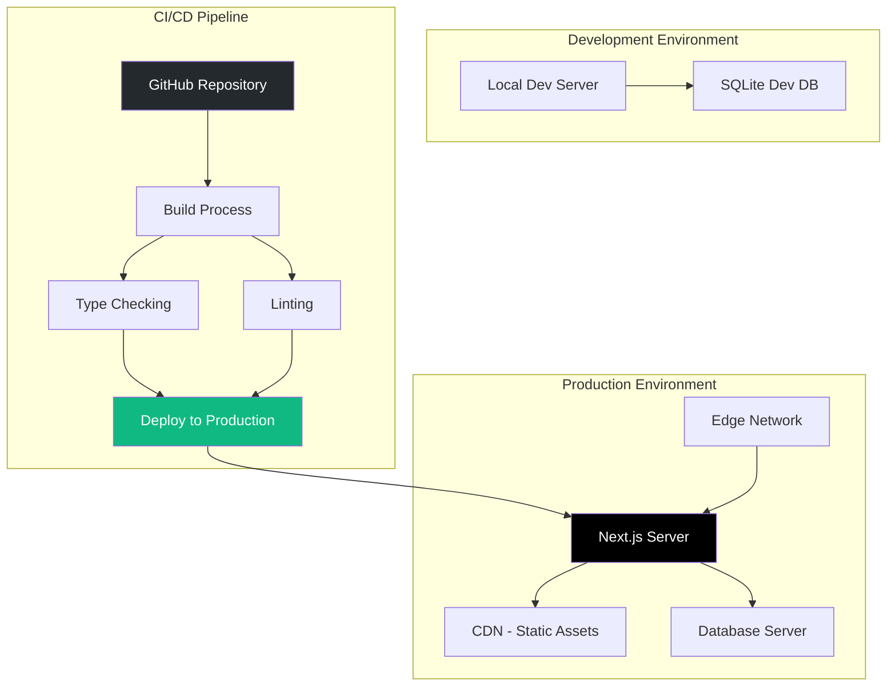
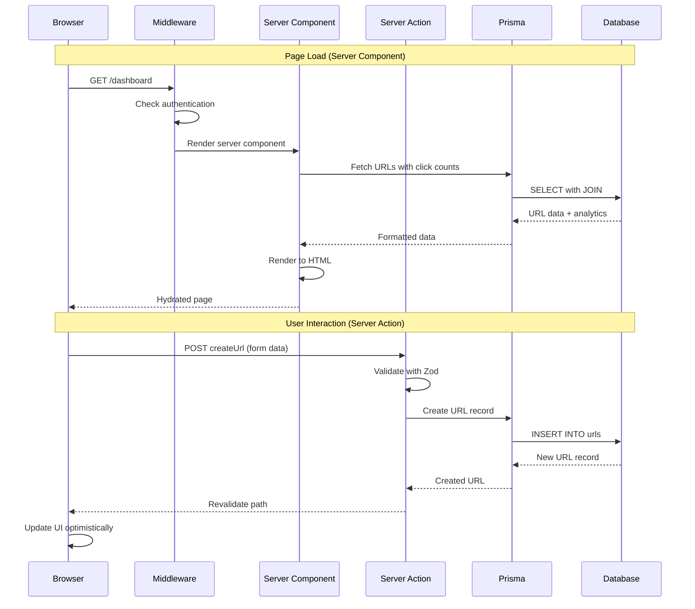
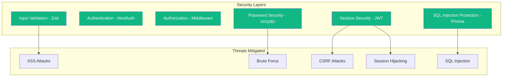
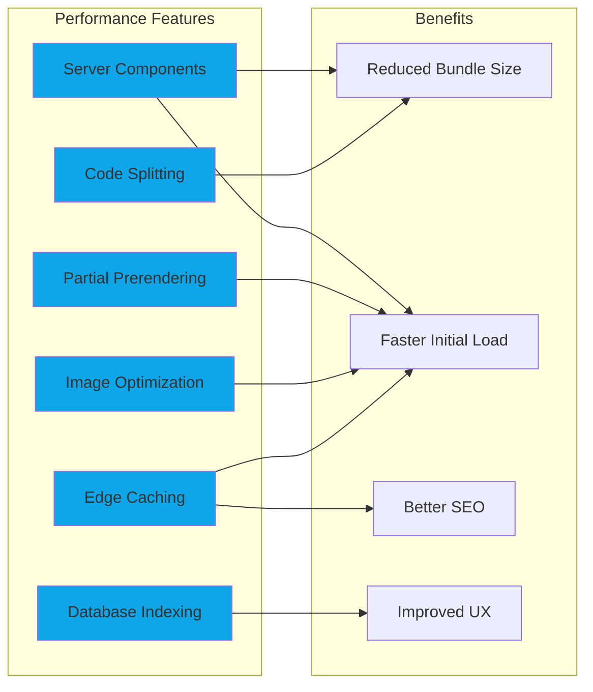

# LinkShort - Architecture Design Documentation

## Portfolio Project: URL Shortener SaaS Platform

This document provides comprehensive architecture diagrams and design documentation for the LinkShort URL shortener platform, demonstrating a production-ready SaaS application built with modern web technologies.

---

## 1. System Architecture Overview

### Description
The system follows a modern layered architecture pattern:
- **Client Layer**: Responsive web interface accessible from any browser
- **Application Layer**: Next.js 14 with App Router providing server-side rendering and routing
- **Authentication Layer**: Secure authentication using NextAuth.js with JWT tokens
- **Business Logic Layer**: Core services for URL management, tracking, and analytics
- **Data Access Layer**: Type-safe database queries with Prisma ORM
- **Database Layer**: SQLite for data persistence
- **Security Layer**: Input validation with Zod and password hashing with bcryptjs

---

## 2. Database Schema Architecture

### Database Design Principles
- **User Model**: Stores authenticated users with secure password hashing
- **URL Model**: Manages shortened URLs with unique 8-character codes (nanoid)
- **Click Model**: Tracks every click with metadata for analytics
- **Relationships**: 
  - One user can create many URLs (1:N)
  - One URL can have many clicks (1:N)
  - Cascade deletion ensures data integrity
- **Indexes**: Optimized foreign key lookups for userId and urlId

---

## 3. Authentication Flow

### Authentication Features
- **Credential-based authentication** using email and password
- **Password security** with bcryptjs hashing
- **Session management** with NextAuth.js v5
- **JWT tokens** for stateless authentication
- **Route protection** via middleware
- **Automatic redirects** for authenticated users

---

## 4. URL Shortening Flow

### URL Shortening Features
- **8-character unique codes** generated using nanoid library
- **URL validation** with Zod schema validation
- **Server Actions** for type-safe mutations
- **Automatic click tracking** with metadata capture
- **Real-time analytics** for each shortened URL
- **One-click copy** to clipboard functionality

---

## 5. Application Layer Architecture

### Component Architecture
- **Server Components**: Data fetching and rendering (Dashboard stats, URL lists)
- **Client Components**: Interactive UI elements (Forms, buttons, modals)
- **Server Actions**: Type-safe server mutations (createUrl, deleteUrl, signup)
- **API Routes**: NextAuth authentication endpoints
- **Layout System**: Nested layouts with dashboard sidebar navigation

---

## 6. Technology Stack Visualization

### Technology Choices & Rationale

#### Frontend
- **Next.js 14**: App Router for modern React architecture, server components, and optimized performance
- **TypeScript**: Type safety and enhanced developer experience
- **Tailwind CSS**: Utility-first CSS framework for rapid UI development
- **shadcn/ui**: High-quality, accessible component library

#### Backend
- **Server Actions**: Type-safe mutations without API endpoints
- **NextAuth.js v5**: Industry-standard authentication solution
- **Prisma**: Type-safe ORM with excellent TypeScript integration

#### Database
- **SQLite**: Lightweight, serverless database perfect for SaaS applications

#### Security & Validation
- **Zod**: Runtime type validation for forms and API inputs
- **bcryptjs**: Secure password hashing
- **nanoid**: Cryptographically secure unique ID generation

---

## 7. Deployment Architecture

### Deployment Options

#### Recommended: Vercel (Optimized for Next.js)
- **Edge Network**: Global CDN for static assets
- **Serverless Functions**: Auto-scaling Next.js server
- **Database**: Can integrate with Vercel Postgres, PlanetScale, or Supabase
- **Zero Configuration**: Deploy with `vercel` CLI or GitHub integration

#### Alternative: Traditional Hosting
- **VPS/Cloud Server**: AWS EC2, DigitalOcean, Linode
- **Node.js Runtime**: Production server with `npm start`
- **Process Manager**: PM2 for reliability
- **Reverse Proxy**: Nginx for SSL and load balancing
- **Database**: SQLite file or migrate to PostgreSQL/MySQL

---

## 8. Request/Response Flow

---

## 9. Security Architecture

### Security Features
- **Input Validation**: All user inputs validated with Zod schemas
- **SQL Injection Prevention**: Parameterized queries via Prisma ORM
- **Password Security**: bcryptjs with salt rounds for secure hashing
- **Session Management**: HTTP-only cookies with JWT tokens
- **Route Protection**: Middleware-based authentication checks
- **CSRF Protection**: Built-in NextAuth.js CSRF tokens

---

## 10. Performance Optimizations

### Optimization Strategies
- **Server Components**: Zero JavaScript for static content
- **Database Indexes**: Fast lookups on userId and urlId
- **Code Splitting**: Automatic route-based splitting
- **Static Generation**: Pre-rendered pages where possible
- **Edge Deployment**: Reduced latency with global distribution

---

## Key Features Summary

### Core Functionality
✅ **URL Shortening**: Generate short, memorable links with 8-character codes  
✅ **Click Tracking**: Real-time analytics with user agent and referrer data  
✅ **User Dashboard**: Clean, modern interface for URL management  
✅ **Authentication**: Secure signup/login with session management  
✅ **Analytics**: Track total clicks per URL with timestamps  
✅ **Copy to Clipboard**: One-click URL copying functionality  

### Technical Highlights
🚀 **Modern Stack**: Next.js 14, TypeScript, Tailwind CSS, Prisma  
🔒 **Security First**: Password hashing, JWT tokens, input validation  
⚡ **Performance**: Server components, edge deployment, optimized queries  
🎨 **Professional UI**: shadcn/ui components with responsive design  
🧪 **Type Safety**: Full TypeScript coverage with Zod validation  
📊 **Scalable**: Modular architecture ready for feature expansion  

---

## Future Enhancements

### Phase 1: Enhanced Analytics
- Detailed click analytics dashboard
- Geographic data visualization
- Time-series click graphs
- Device and browser breakdowns

### Phase 2: Advanced Features
- Custom short URLs (vanity URLs)
- QR code generation
- Link expiration dates
- Password-protected links

### Phase 3: Team Features
- Multi-user workspaces
- Team collaboration
- Role-based access control
- Shared link collections

### Phase 4: Enterprise Features
- API for programmatic access
- Webhooks for click events
- White-label options
- Advanced security features

---

## Architecture Design Principles

1. **Separation of Concerns**: Clear boundaries between layers
2. **Type Safety**: TypeScript throughout the application
3. **Security by Design**: Multiple security layers and validations
4. **Scalability**: Modular architecture supports growth
5. **Developer Experience**: Modern tooling and best practices
6. **Performance First**: Optimized rendering and data fetching
7. **Maintainability**: Clean code with consistent patterns

---

## Conclusion

This architecture demonstrates a production-ready SaaS application built with modern web technologies. The system is designed to be:

- **Secure**: Multiple security layers protect user data
- **Scalable**: Architecture supports growth and feature additions
- **Performant**: Optimized for speed and user experience
- **Maintainable**: Clean, typed code with clear patterns
- **Professional**: Industry-standard tools and practices

The LinkShort platform showcases expertise in full-stack development, modern React patterns, authentication systems, database design, and cloud deployment strategies.

---

**Author**: Software Engineer Portfolio Project  
**Technologies**: Next.js 14, TypeScript, React, Prisma, NextAuth.js, Tailwind CSS  
**Repository**: [github.com/adefirmanf/simple-saas](https://github.com/adefirmanf/simple-saas)  
**License**: MIT
