# LinkShort - Visual Architecture Diagrams

Quick reference for all architecture diagrams. These diagrams can be rendered in any Markdown viewer that supports Mermaid.

---

## Quick Navigation
- [System Overview](#system-overview)
- [Database Schema](#database-schema)
- [Authentication Flow](#authentication-flow)
- [URL Shortening Flow](#url-shortening-flow)
- [Component Architecture](#component-architecture)
- [Tech Stack](#technology-stack)
- [Deployment](#deployment-architecture)
- [Security](#security-layers)

---

## System Overview

**High-level architecture showing all system layers and their interactions**

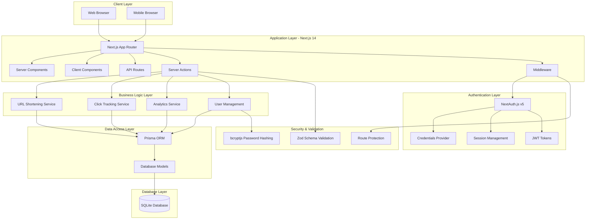

---

## Database Schema

**Entity Relationship Diagram showing data models and relationships**

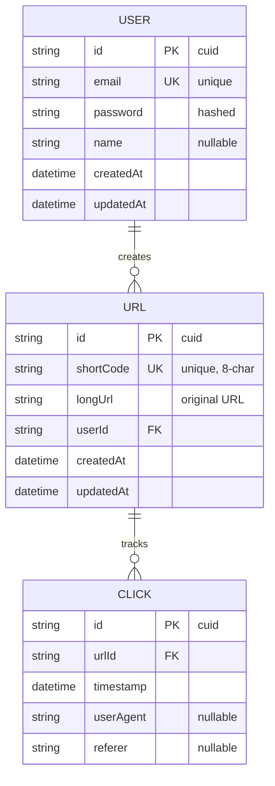

---

## Authentication Flow

**Complete authentication sequence including signup, login, and route protection**

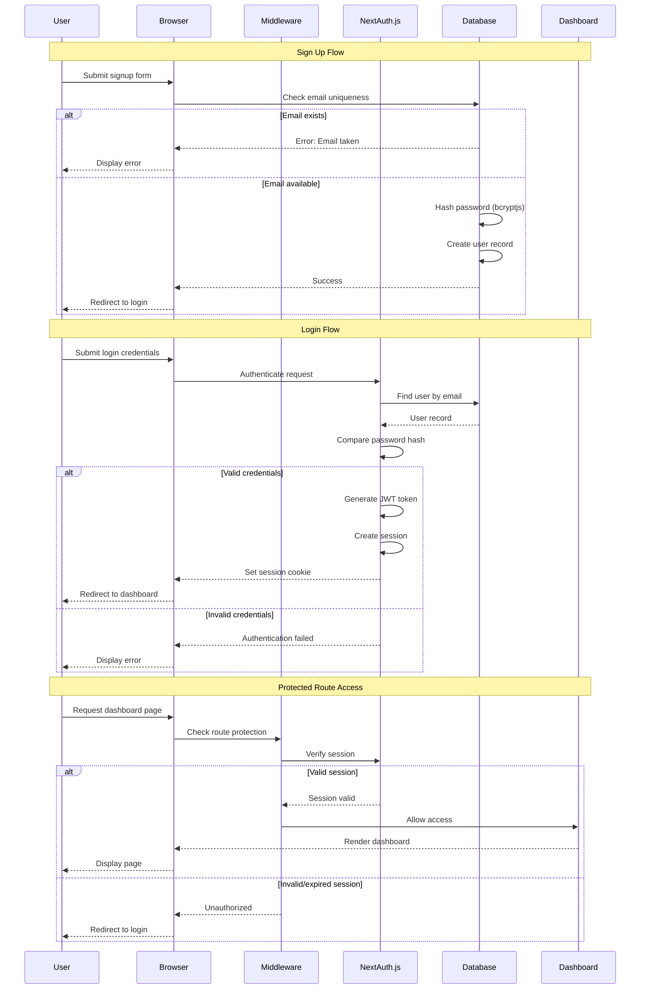

---

## URL Shortening Flow

**URL creation and access flow with click tracking**

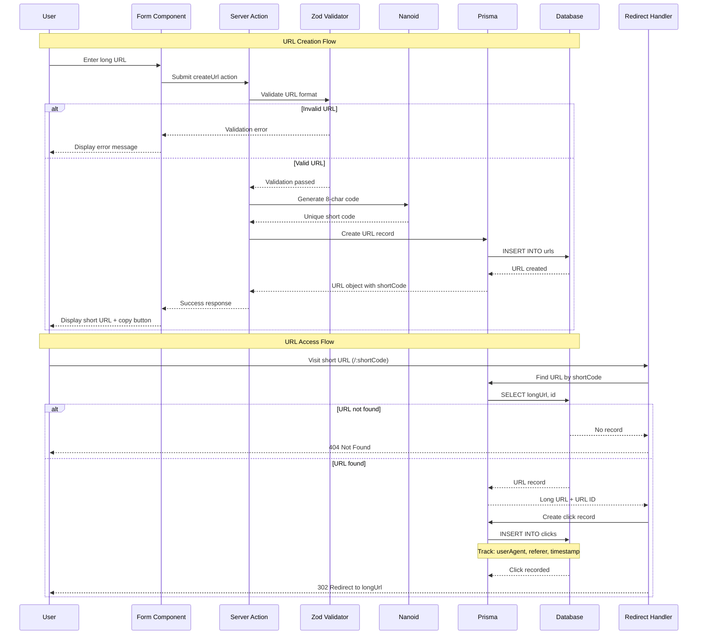

---

## Component Architecture

**Application component structure and relationships**

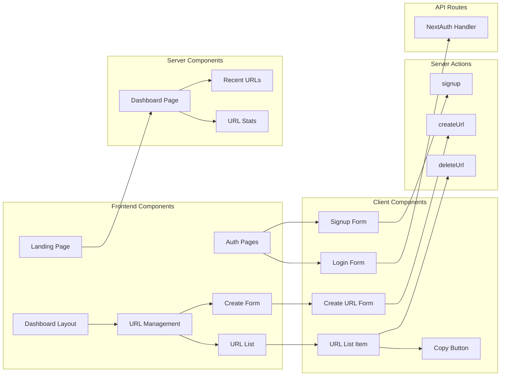

---

## Technology Stack

**Complete technology stack with dependencies**

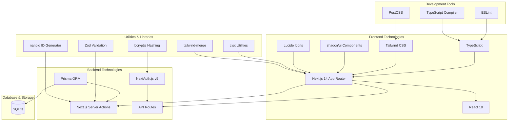

---

## Deployment Architecture

**Production and development deployment options**

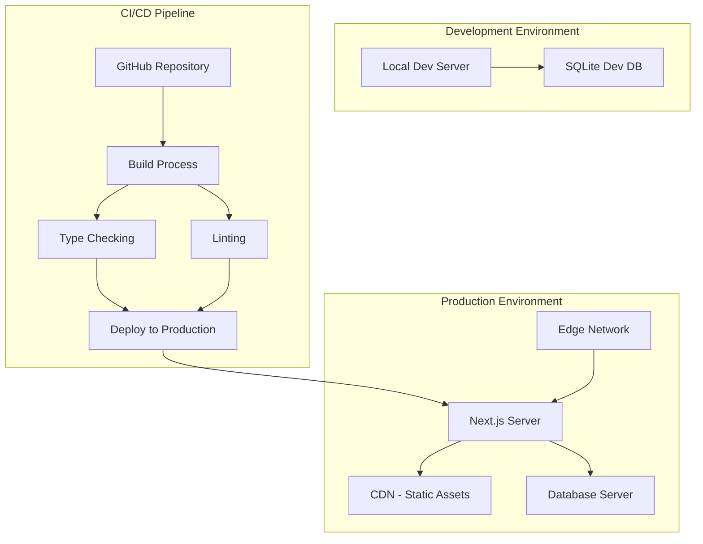

---

## Security Layers

**Multi-layered security approach**

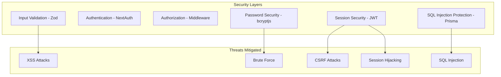

---

## Request Flow

**Detailed request/response flow through the system**

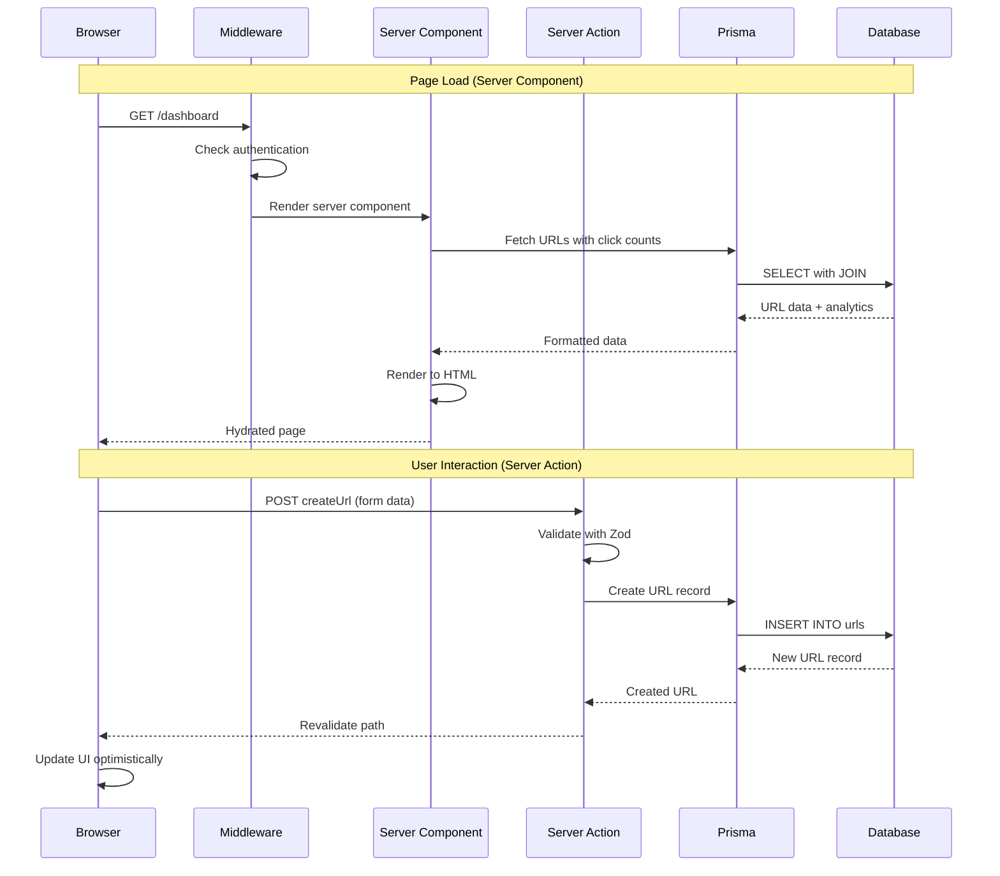

---

## Performance Optimizations

**System performance features and benefits**

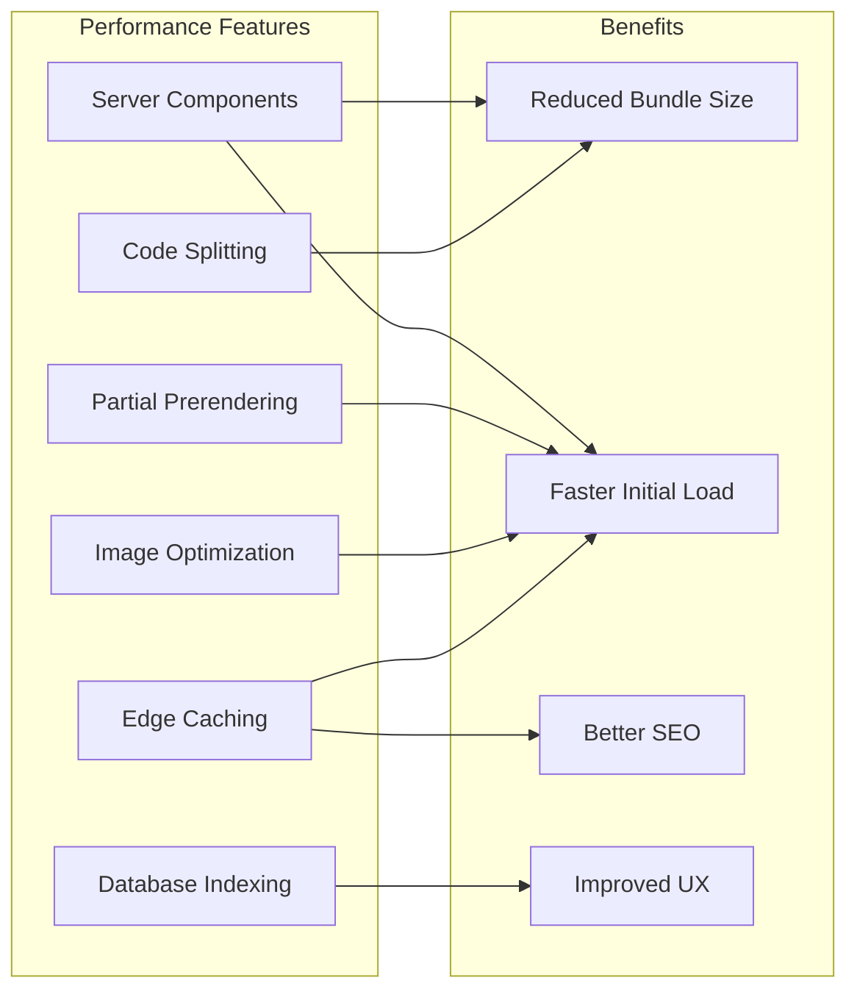

---

## Data Flow Architecture

**How data flows through the application**

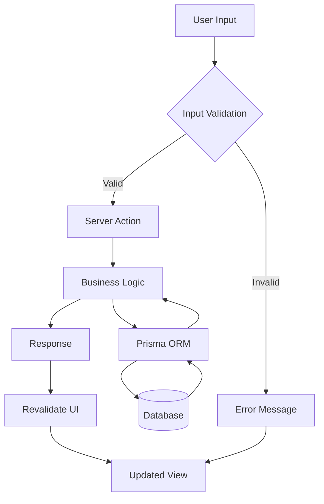

---

## Feature Expansion Roadmap

**Planned architecture evolution**

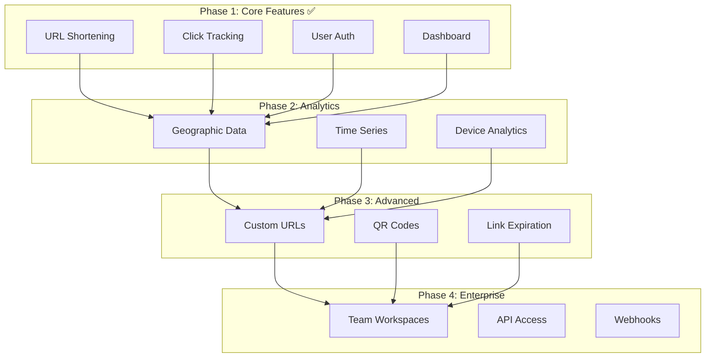

---

## File Structure

**Project directory organization**

```
simple-saas/
├── app/                        # Next.js App Router
│   ├── (auth)/                # Auth route group
│   │   ├── login/             # Login page
│   │   └── signup/            # Signup page
│   ├── dashboard/             # Protected dashboard
│   │   ├── urls/              # URL management
│   │   └── page.tsx           # Dashboard home
│   ├── [shortCode]/           # Dynamic redirect
│   ├── api/auth/              # NextAuth routes
│   └── layout.tsx             # Root layout
├── lib/                       # Shared libraries
│   ├── prisma.ts              # DB client
│   └── utils.ts               # Utilities
├── prisma/                    # Database
│   ├── schema.prisma          # Schema definition
│   └── migrations/            # Migration files
├── auth.ts                    # NextAuth setup
├── auth.config.ts             # Auth configuration
├── middleware.ts              # Route protection
└── package.json               # Dependencies
```

---

## API Endpoints

**Available endpoints and their purposes**

| Endpoint | Method | Purpose | Auth Required |
|----------|--------|---------|---------------|
| `/` | GET | Landing page | No |
| `/login` | GET | Login page | No |
| `/signup` | GET | Signup page | No |
| `/dashboard` | GET | Dashboard home | Yes |
| `/dashboard/urls` | GET | URL management | Yes |
| `/api/auth/[...nextauth]` | ALL | NextAuth handler | Mixed |
| `/[shortCode]` | GET | Redirect to long URL | No |

**Server Actions**

| Action | Purpose | Auth Required |
|--------|---------|---------------|
| `createUrl` | Create short URL | Yes |
| `deleteUrl` | Delete URL | Yes |
| `signup` | Register new user | No |

---

**These diagrams can be copied into presentations, documentation, or portfolio materials.**

**View full documentation**: [ARCHITECTURE.md](../ARCHITECTURE.md)
